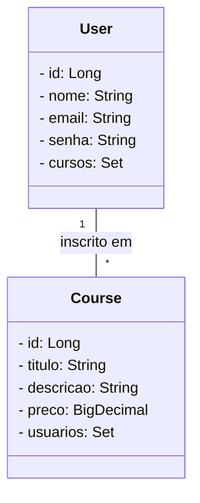

## 7º DESAFIO JAVA - Publicando Sua API REST na Nuvem Usando Spring Boot 3, Java 17 e Railway

Esse é o projeto proposto pelo Bootcamp DIO onde devemos criar uma api que explore o conceito de spring boot, web, banco de dados postgres e h2.

##Diagrama de classes

