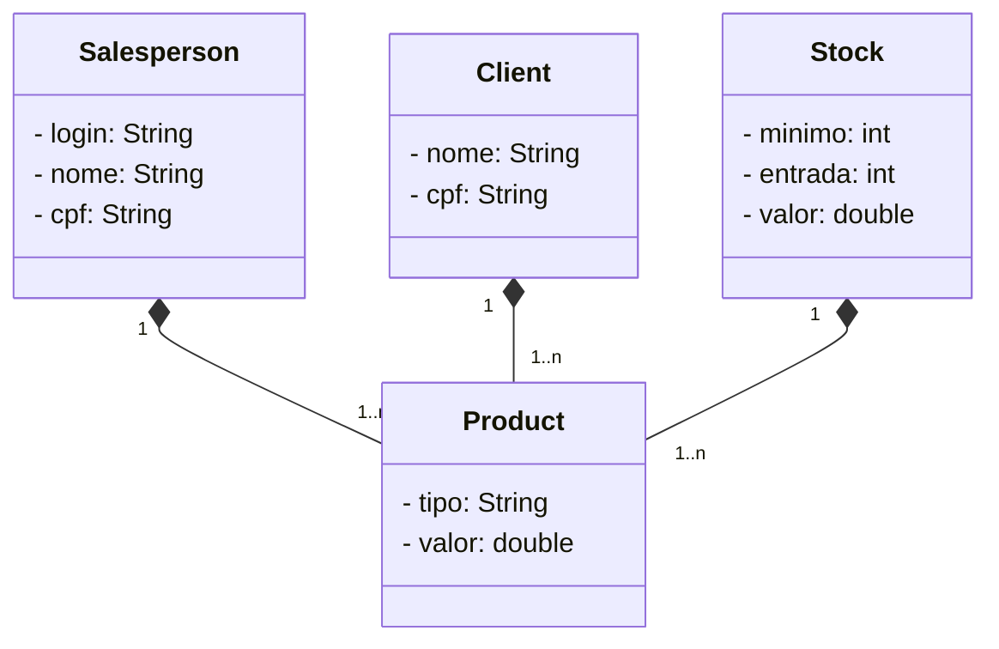

# desafio-dio-api-nuvem-spring

##Diagrama de classes

```mermaid
classDiagram
    class Salesperson {
        - login: String
        - nome: String
        - cpf: String
    }
    
    class Client {
        - nome: String
        - cpf: String
    }
    
    class Product {
        - tipo: String
        - valor: double
    }
    
    class Stock {
        - minimo: int
        - entrada: int
        - valor: double
    }
    
    Salesperson "1" *-- "1..n" Product
    Client "1" *-- "1..n" Product
    Stock "1" *-- "1..n" Product
```
